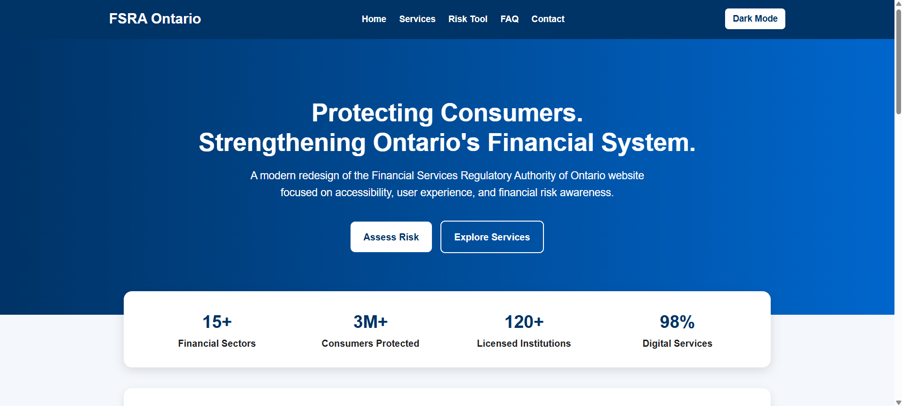

# 🛡️ FSRA Website Redesign

A modern, responsive front-end website redesign inspired by the Financial Services Regulatory Authority of Ontario (FSRA). This project demonstrates responsive web development, accessibility principles, and interactive JavaScript features commonly used in government and financial services websites.

> **Disclaimer:** This is an independent educational portfolio project created for learning and demonstration purposes. It is **not affiliated with, endorsed by, or sponsored by the Financial Services Regulatory Authority of Ontario (FSRA).**

---

# 📌 Project Overview

The objective of this project was to redesign a government-style website using modern front-end development practices while focusing on:

* Responsive web design
* Accessibility
* Clean user interface
* Interactive JavaScript functionality
* Mobile-first development

This project was built as part of my software development portfolio to demonstrate practical front-end skills for internship and co-op opportunities.

---

# ✨ Features

* 🌐 Responsive Navigation Bar
* 🎨 Modern Hero Section
* 📊 Statistics Dashboard
* 🛡️ Government-Style Service Cards
* ⚠️ Financial Risk Assessment Tool
* ❓ Interactive FAQ Accordion
* 📝 Contact Form with Client-Side Validation
* 🌙 Dark Mode Toggle
* 📱 Fully Responsive Layout

---

# 🛠️ Technologies Used

* HTML5
* CSS3
* JavaScript (ES6)

---

# 🎯 Skills Demonstrated

* Responsive Web Design
* HTML5 Semantic Markup
* CSS Flexbox & Grid
* JavaScript DOM Manipulation
* Event Handling
* Form Validation
* User Interface Design
* Accessibility Best Practices
* Mobile-First Development

---

# 📸 Project Screenshots

## 🏠 Homepage



---

## 🌙 Dark Mode


---

## ⚠️ Financial Risk Assessment Tool


---

## 📱 Mobile Responsive View


---

# 📂 Folder Structure

```text
FSRA-Website-Redesign/
│
├── index.html
├── style.css
├── script.js
├── README.md
│
└── assets/
    ├── homepage.png
    ├── darkmode.png
    ├── risktool.png
    └── mobileview.png
```

---

# 🚀 Getting Started

## Clone the Repository

```bash
git clone https://github.com/EricRathod/FSRA-Website-Redesign.git
```

## Run Locally

1. Download or clone the repository.
2. Open the project in **Visual Studio Code**.
3. Install the **Live Server** extension.
4. Open `index.html` using **Live Server**.

---

# 💡 Future Improvements

* Backend integration for the contact form
* Live financial data integration
* User authentication
* WCAG 2.1 AA accessibility enhancements
* Interactive dashboards
* Multi-language support

---

# 👨‍💻 Author

**Eric Rathod**

Master of Artificial Intelligence – Design and Development

Seneca Polytechnic

GitHub: https://github.com/EricRathod

LinkedIn: www.linkedin.com/in/eric-rathod-aa335a310

---

# ⭐ Acknowledgements

This project was developed independently for educational and portfolio purposes to strengthen my front-end web development skills. The design is inspired by public-sector web design principles and is intended solely as a demonstration of technical ability.
